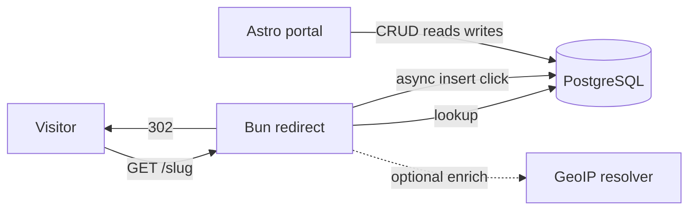

# Product plan: personal URL shortener

This document is the **authoritative product and technical plan** for a single-tenant URL shortener: public redirects on `c.anh.pw` and a management portal on `short.anh.pw`. Implementation details may live in code and ADRs; this file tracks **what** we build, **why**, and **in what order**.

**Related assets**

- Visual and UI rules: [design.md](../design.md) (must be followed for all portal UI).
- Stack: Bun (redirect service), Astro + Svelte (portal SSR), PostgreSQL, optional Effect in shared/portal layers.

---

## 1. Vision and scope

### 1.1 Purpose

You need a **fast redirect surface** and a **rich marketer-style portal** for one user: create short links (random or custom), skim destinations via **list previews** (unfurled metadata), attach **long-form markdown notes** per link for campaign context, measure with **country/region analytics and maps**, import links in bulk, and capture **as much signal as safely practical** per click for analysis—not for resale or multi-tenant SaaS.

### 1.2 Non-goals (for now)

- Multi-user organizations, billing, or public signup.
- Custom domains per customer (only the fixed short host unless you add this later).
- Legal/compliance program for third-party data subjects (this is a personal tool; you still should understand local law if you ever expose it beyond yourself).

### 1.3 Architecture (two apps)

| App | Host | Role |
|-----|------|------|
| Redirect | `c.anh.pw` | Minimal Bun HTTP: resolve slug → redirect; record click events **without blocking** the response when possible. |
| Portal | `short.anh.pw` | Astro + Svelte SSR: link CRUD, **list with target URL previews**, **markdown notes** with truncation + full view, bulk import, analytics, maps, exports. |

**Why split:** smaller attack surface and memory on the redirect path, independent deploy/scaling, no admin cookies on the click domain.



---

## 2. Design system (mandatory)

All **portal** screens (not the bare redirect responses) MUST follow [design.md](../design.md).

### 2.1 Summary of design tokens

- **Palette:** Primary `#0F1112`, Secondary `#6F7478`, Tertiary `#00A36C` (single accent—one primary action per view), Neutral `#FAFAF8`, Surface `#FFFFFF`.
- **Typography:** IBM Plex Sans (display, h1, body); IBM Plex Mono (labels).
- **Shape:** Flat—no gradients; hairline borders; radii sm/md/lg as specified.
- **Components:** Primary buttons use Tertiary; cards use Surface on Neutral background.

### 2.2 Product implications

- Analytics dashboards use **Neutral** page background, **Surface** cards, **Secondary** chart axes/grids, **Tertiary** for the single dominant action per page (e.g. “Export”, “Save links”).
- Map and chart libraries must be **themed** to this palette (no default multi-color rainbow as the primary visual language unless data series require distinction—prefer monochrome + Tertiary highlights).

---

## 3. Personas and access

### 3.1 Primary user

You: create links, analyze traffic, bulk-import campaigns.

### 3.2 Authentication (phased)

- **Now:** No in-app auth. Rely on **deployment-level protection**: e.g. VPN/Tailscale-only bind, reverse-proxy basic auth, IP allowlist, or SSH tunnel. Document the chosen mechanism in deployment notes.
- **Later:** Integrate proper auth (password, SSO, or both) on the portal only; redirect app remains public for `GET /:slug`.

---

## 4. Functional requirements

### 4.1 Short links

| Requirement | Detail |
|-------------|--------|
| Slug modes | **Random** default (cryptographically acceptable short id, e.g. base62 length configurable); **user-defined** slug when provided. |
| Uniqueness | Slug globally unique; reject conflicts with clear error. |
| Destination | HTTPS preferred; validate URL scheme (block `javascript:`, etc.); normalize where safe. |
| Redirect type | Per link: **301** or **302** (default policy documented in UI). |
| Title / metadata fetch | On create/edit, **optional “Fetch from URL”** (same safe fetch as today): HTTP GET with strict timeout (e.g. 3–5s), size cap; parse `<title>`, Open Graph / Twitter tags. Populate **`display_title`** (editable) and **`target_preview`** (see §5.1)—used for portal list and detail only, not for redirect behavior. |
| Status | Active / paused (paused returns configurable: 404 or simple HTML “link inactive”). |
| Expiry | Optional `expires_at` and/or max clicks (optional stretch). |

### 4.2 Portal: link list, target preview, and notes

#### 4.2.1 Target URL preview in the list

The **main links list** (and any compact link rows) should surface a **visual/text preview of the destination**, not only the short slug and raw URL.

| Requirement | Detail |
|-------------|--------|
| Preview content | Prefer **Open Graph** / Twitter Card data when present: **image** (`og:image` or equivalent), **title** (aligned with `display_title`), **short description** (`og:description` or meta description), and **canonical hostname** of the destination for quick scanning. |
| Fallback | If fetch failed or image missing: show **placeholder** (neutral Surface card, Secondary text) with domain + `display_title` or truncated URL—still matching [design.md](../design.md) (flat, no gradients). |
| Stale data | Optional **“Refresh preview”** on row or edit screen to re-run fetch; store **`preview_fetched_at`** to show age in UI if useful. |
| Performance | List view reads **denormalized fields from Postgres** (no per-row live HTTP in list); fetching happens on create/edit/refresh only. |

#### 4.2.2 Per-link notes (GitHub-style markdown)

Each link has an optional **note** for your own organization (campaign context, where you posted the link, reminders, etc.).

| Requirement | Detail |
|-------------|--------|
| Storage | Single text field per link, stored as **Markdown source** (UTF-8). |
| Editor UX | **Write** and **Preview** tabs (or side-by-side on wide screens), similar in spirit to GitHub issue/comment composition: user types markdown, switches to preview to validate rendering. |
| Markdown scope | Support **common GitHub-flavored basics**: paragraphs, **headings**, **bold/italic**, **inline code**, **fenced code blocks**, **links**, **lists**, **blockquotes**, **tables**, **task lists** if low-cost; strikethrough optional. Explicitly **do not** require full GFM (e.g. autolink every URL without angle brackets can be phased). |
| Security | Render preview and “view full” content with a **hardened pipeline** (allowlist elements, no raw HTML by default, safe link `rel` attributes) to avoid XSS in the portal. |
| Length | Notes may be **long**; no aggressive hard cap in product spec beyond reasonable DB `TEXT` limits and a documented max (e.g. 64KB) for abuse-of-self prevention. |
| List row display | In the list, show a **truncated excerpt** of the note: e.g. **2–3 lines** with CSS `line-clamp` (or equivalent), Secondary typography, no full markdown render in the row (plain text excerpt or stripped markdown is fine to avoid layout blow-ups). |
| Full note | **“View full”** (or row action) opens a **modal dialog** (or large drawer) showing the full note with **rendered markdown** (same renderer as Preview tab), scrollable, dismissible. Optional **“Edit”** from dialog jumps to edit screen or inline editor. |

### 4.3 Bulk operations

| Requirement | Detail |
|-------------|--------|
| Mass create | Paste **one URL per line**; optional second column (tab/comma) for custom slug if we support CSV-like paste; validate each row; show per-line errors before commit. |
| Import summary | Show count created, skipped, failed; downloadable error report. |
| Export | CSV/JSON of links + aggregates (phase 2b if needed after MVP analytics). |

### 4.4 Analytics and statistics

**Principle:** For a personal tool, maximize **stored observability per click** while keeping the redirect fast (async insert / queue if needed).

#### 4.4.1 Per-click capture (planned fields)

Store as much as is practical from the HTTP request and enrichment:

| Category | Fields (examples) |
|----------|-------------------|
| Identity of event | `id`, `link_id`, `occurred_at` (timestamptz UTC). |
| Request line | Short URL path/slug clicked, resolved `destination_url` snapshot optional (stretch). |
| Network | **`ip`** as `INET` or `TEXT` (your choice for portability); optionally also store hashed-only variant later for sharing exports. |
| Headers | `referer`, `user_agent`, `accept_language`; optional **`raw_headers` JSONB** (bounded size, whitelist keys) if you want future-proof debugging. |
| Derived | Parsed **browser**, **OS**, **device type** (from UA parser library); **`is_bot`** flag. |
| Geo | **`country_code`**, **`region`** (subdivision), **`city`** (if available), **`latitude`**, **`longitude`** (if available from GeoIP DB); **`asn`** or **`network`** optional. |
| TLS / proxy | If behind reverse proxy: trust `X-Forwarded-For` only from trusted hop; record `cdn_country` header if provider supplies it (e.g. Cloudflare `CF-IPCountry`) as redundancy. |

**Geo resolution:** Offline DB (e.g. MaxMind GeoLite2 or similar) loaded in redirect worker or asynchronously: either resolve in redirect process after enqueue, or store IP first and enrich via delayed job—document tradeoff (real-time dashboards vs simplicity).

#### 4.4.2 Aggregates and UX

| Feature | Detail |
|---------|--------|
| Overview | Total clicks, unique visitors (see note), time range filter. |
| Time series | Clicks per hour/day/week. |
| Breakdowns | By country, region, city; by device type; by browser/OS; by referrer (top N). |
| **Maps** | **World / region choropleth** by country; optional **drill-down** to region/city table; if lat/lon present, optional **point map** (sparse—use with care). |
| Bot traffic | Filter “human only” vs “all” using `is_bot`. |

**Unique visitors:** With raw IP stored, you can approximate uniques per day via `date_trunc('day', occurred_at)` + `ip`. If you later prefer privacy-hardening, switch to daily salted hash of IP in exports only—out of scope until you need it.

### 4.5 Marketer features (roadmap alignment)

Prioritize after core redirect + rich logging + basic portal:

- UTM templates and apply-on-create.
- Tags / folders and search.
- QR codes (SVG/PNG) per link.
- HTTP API + API keys for automation.
- Webhooks (optional).

---

## 5. Data model (PostgreSQL)

**Decision: PostgreSQL only** (no SQLite path in this plan).

### 5.1 Tables (conceptual)

**`links`**

- `id` (uuid, pk)  
- `slug` (text, unique, indexed)  
- `destination_url` (text)  
- `display_title` (text, nullable) — from fetch or manual edit; surfaced in list preview  
- **`target_preview`** (jsonb, nullable) — denormalized unfurl payload for fast list/detail rendering, e.g. `{ imageUrl?, description?, siteName? }` (exact keys are an implementation detail; keep migrations stable once shipped). Populated by the same “Fetch from URL” pipeline as §4.1; **nullable** when never fetched or fetch failed.  
- **`preview_fetched_at`** (timestamptz, nullable) — last successful (or attempted) preview refresh, for UI staleness hints and “Refresh preview”.  
- `redirect_type` (smallint or enum: `301` / `302`)  
- `status` (enum: `active` / `paused`)  
- `expires_at` (timestamptz, nullable)  
- `created_at`, `updated_at`  
- **`notes_markdown`** (text, nullable) — per-link notes in **Markdown** (§4.2.2); soft cap e.g. 64KB documented in UI.  
- Optional: `utm_template_id` (fk, nullable)  

**`click_events`** (append-only)

- `id` (bigserial)  
- `link_id` (fk → links)  
- `occurred_at` (timestamptz, default now)  
- `ip` (inet or text)  
- `referrer` (text, nullable)  
- `user_agent` (text, nullable)  
- `accept_language` (text, nullable)  
- `country_code` (char(2), nullable)  
- `region` (text, nullable)  
- `city` (text, nullable)  
- `latitude`, `longitude` (double precision, nullable)  
- `browser`, `os`, `device_type` (text, nullable)  
- `is_bot` (boolean, default false)  
- `raw_headers` (jsonb, nullable) — optional, size-limited  

**Indexes (minimum)**

- Unique: `links(slug)`  
- `click_events(link_id, occurred_at DESC)`  
- `click_events(occurred_at)` for global maintenance  
- `click_events(country_code)` (partial where not null) for map queries  

**Future:** `utm_templates`, `tags`, `link_tags`, `api_keys` as in original plan.

### 5.2 Retention (optional policy)

Document whether you keep raw `click_events` forever or partition by month. Large personal datasets are fine; partitions help maintenance.

---

## 6. Technical notes

### 6.1 Redirect path performance

1. Parse slug; reject invalid pattern early.  
2. Load link (optional LRU cache for hot slugs; invalidate on portal update).  
3. Return redirect immediately.  
4. **Record analytics** via `queueMicrotask`/Bun equivalent, or insert to Postgres with connection pooling—if insert latency is observable, use **internal queue + batch writer** or separate lightweight worker reading from Redis/stream (only if needed).

### 6.2 URL fetch (title + Open Graph) and SSRF

- Cap response bytes; SSRF controls: block private/link-local IP targets, cap redirects, short timeouts.  
- Parse HTML for `<title>`, `og:title`, `og:description`, `og:image` (and reasonable Twitter fallbacks). Sanitize **stored** image/description strings (length limits, strip scripts).  
- Clear UX when fetch fails: empty `target_preview`, message on edit screen (“Preview unavailable”).  
- **`og:image`** may be remote: list UI uses `` with sensible dimensions (object-fit, max height)—no mixed-content surprises if portal is HTTPS-only.

### 6.3 Markdown notes (portal)

- Use one **trusted markdown → HTML** (or AST → components) pipeline for Preview tab and “View full” dialog: **GFM subsets** aligned with §4.2.2, XSS-safe by default.  
- List excerpts: derive plain text by stripping markup or using first N characters of source with line clamp—implementation choice; avoid executing raw HTML from user notes.

### 6.4 Effect (TypeScript)

- Use Effect in **`packages/core`** and **portal** for schemas, services, and composable error channels.  
- Keep **redirect** handler thin; shared **pure validation** from core is fine.

### 6.5 Repository layout (target)

```
apps/redirect      # Bun
apps/portal        # Astro + Svelte + Bun
packages/core      # Types, Effect, validation, slug generation
docs/PRODUCT_PLAN.md
design.md
```

---

## 7. Phased delivery

### Phase 0 — Skeleton

- Monorepo, Postgres connection, migrations tool (Drizzle/Kysely/SQL chosen in implementation).  
- `design.md` tokens applied to portal shell (layout, typography, single-accent buttons).

### Phase 1 — Links + redirect + logging

- Random + custom slugs; open-redirect protections.  
- Redirect app on Bun; `click_events` insert with core fields at minimum: time, link, ip, referrer, ua, accept_language.  
- Portal: create/edit/delete link; **“Fetch from URL”** populating `display_title` + `target_preview`; **links list** with **destination preview** (image + title + description + domain per §4.2.1); **`notes_markdown`** with Write/Preview editor and **truncated row excerpt + “View full” dialog** (§4.2.2); all styled per [design.md](../design.md).

### Phase 2 — Richer click context + analytics UI

- UA parsing; `is_bot`; GeoIP enrichment (sync or async).  
- Dashboards: tables + charts (time series, breakdowns).  
- **Maps:** country-level (required), region/city as data allows.  
- Filters: date range, link, human/bot.

### Phase 3 — Bulk + export + marketer tools

- Mass paste import; CSV export of links + rollups.  
- UTM templates, tags, QR, pause/expiry polish.

### Phase 4 — API and auth

- REST + API keys.  
- Replace deployment-only protection with integrated auth.

---

## 8. Success criteria

- Redirect latency remains dominated by network/DB lookup, not analytics write path.  
- You can answer: “Which country/region drove clicks this week?” with map + table.  
- Creating 100 links from a pasted list is reliable and shows errors clearly.  
- Portal is visually consistent with [design.md](../design.md).  
- PostgreSQL schema supports full click signal without awkward migrations for Phase 2.  
- **Link list** makes destinations scannable via **stored target previews**, not only raw URLs.  
- **Notes** support markdown (including tables/links), preview in editor, truncated list display, and **safe full rendering** in a dialog.

---

## 9. Open technical choices (implementation time)

- GeoIP vendor/library and update strategy for DB files.  
- Whether `raw_headers` is enabled by default or behind a config flag (storage cost).  
- Exact random slug alphabet and length (collision handling = retry).  
- Cache layer (in-process vs Redis) for slug resolution—start without Redis if possible.  
- Markdown implementation (library choice) and exact GFM subset shipped in v1.  
- Modal vs drawer for “View full” notes (accessibility: focus trap, Escape to close).

---

## Document history

| Version | Notes |
|---------|--------|
| 1.0 | Initial detailed plan: Postgres, deferred auth, rich analytics, maps, bulk import, title fetch, design.md binding. |
| 1.1 | Portal: list **target URL previews** (OG-backed, denormalized `target_preview`); per-link **`notes_markdown`** with GitHub-style Write/Preview, list truncation + **View full** dialog; section renumbering (§4.2–4.5). |
